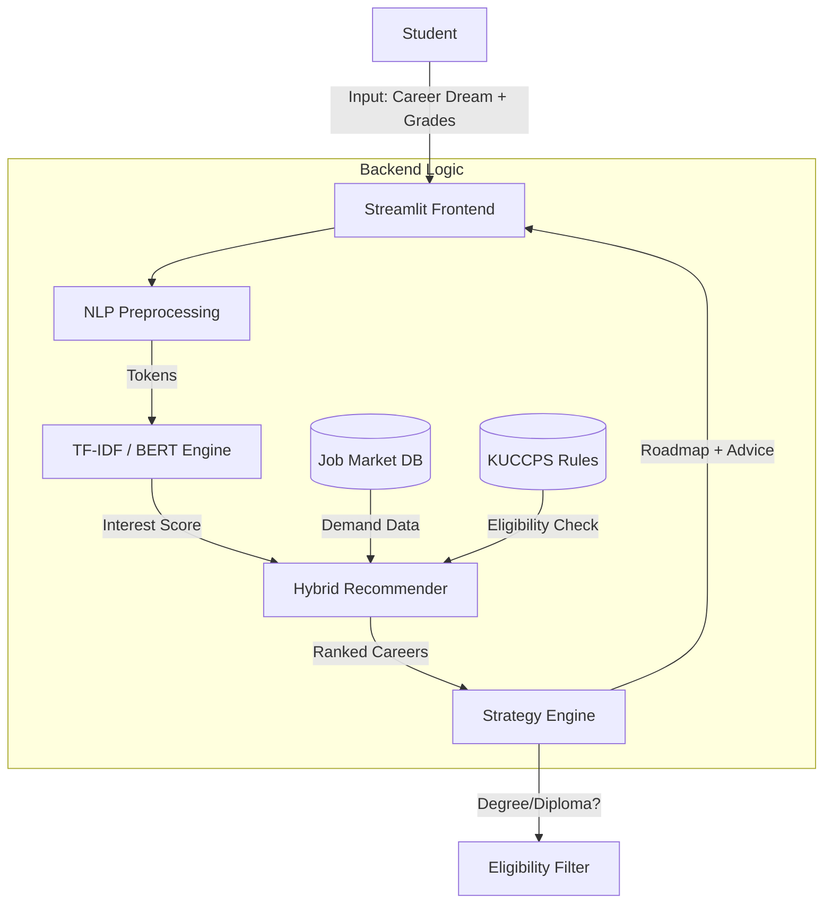

# System Architecture

## High-Level Data Flow

## Component Breakdown

1.  **Frontend**: Streamlit-based UI for real-time interaction.
2.  **NLP Pipeline**:
    *   Tokenization & Lemmatization (NLTK)
    *   Vectorization (TF-IDF + BERT fallback)
    *   Similarity Matching (Cosine Similarity)
3.  **Market Engine**:
    *   Scraper (Selenium) -> `scraped_jobs.csv`
    *   Metrics Aggregator -> `job_demand_metrics.csv`
4.  **Eligibility Engine**:
    *   Input: Student Mean Grade + Subject Clusters.
    *   Logic: Compares against `kuccps_requirements.json`.
    *   Output: `ELIGIBLE`, `NOT ELIGIBLE`, `ASPIRATIONAL`.
